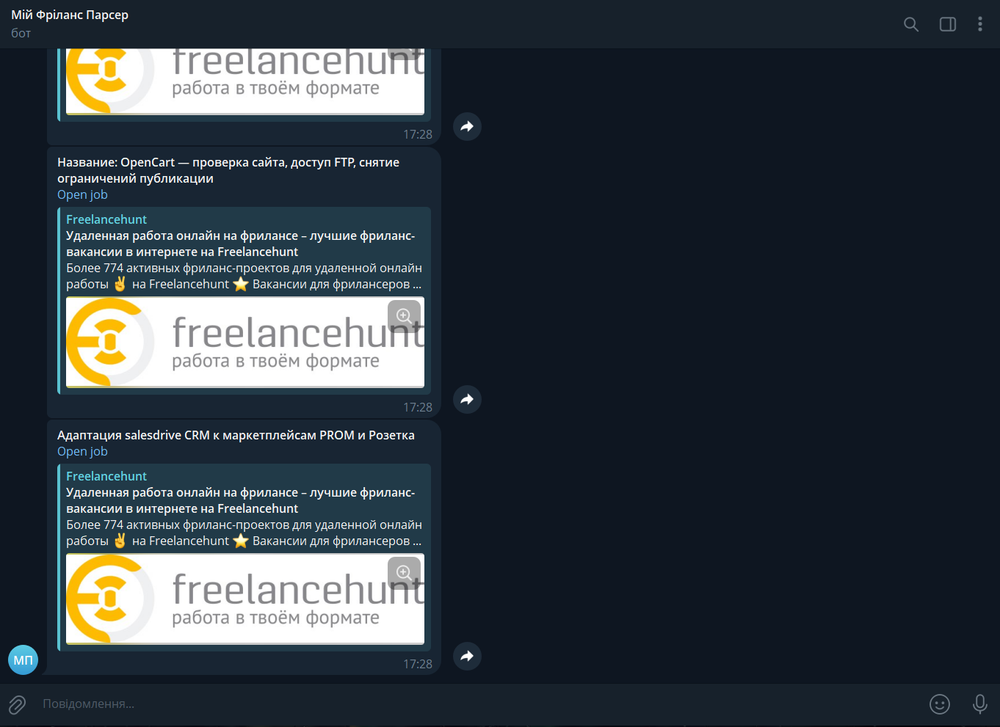

# Freelance Hunter Bot

An asynchronous Python bot that monitors new projects on Freelancehunt and instantly sends notifications via Telegram.



## Business Value
- Helps freelancers react faster to new Freelancehunt opportunities in selected categories.
- Reduces manual page refreshing by continuously polling the target endpoint.
- Sends instant Telegram notifications so you can submit proposals before competitors.

## Tech Stack


Dependencies (from `pyproject.toml`):
- `aiogram`
- `aiohttp`
- `beautifulsoup4`
- `curl-cffi`
- `loguru`
- `lxml`
- `pydantic`
- `pydantic-settings`

## Features
- Fetches Freelancehunt HTML pages asynchronously via `curl_cffi` with browser impersonation (`chrome120`) to handle anti-bot protection patterns.
- Parses job title, URL, and budget using `BeautifulSoup` + `lxml`.
- Tracks already-seen job URLs in memory and notifies only about new jobs.
- Sends formatted HTML Telegram messages with safe escaping.
- Runs continuously on a configurable interval (`PARSE_INTERVAL_SECONDS`).

## Local Setup & Installation
### Clone repository
```bash
git clone https://github.com/khomych-dev/freelance-hunter-bot.git
cd freelance-hunter-bot
```

### Configure environment variables
Create a `.env` file in the project root based on `.env.example`:

```env
TELEGRAM_TOKEN=
TELEGRAM_CHAT_ID=
FREELANCEHUNT_URL=https://freelancehunt.com
FREELANCEHUNT_ENDPOINT=/projects?skills%5B0%5D=1&skills%5B1%5D=22&skills%5B2%5D=99
PARSE_INTERVAL_SECONDS=300
```

Variable meaning:
- `TELEGRAM_TOKEN` - Telegram bot token from BotFather.
- `TELEGRAM_CHAT_ID` - Target chat/user ID to receive notifications.
- `FREELANCEHUNT_URL` - Base Freelancehunt URL.
- `FREELANCEHUNT_ENDPOINT` - Listing endpoint with your desired filters.
- `PARSE_INTERVAL_SECONDS` - Polling interval in seconds.

### Install dependencies with `uv`
```bash
uv sync
```

## Running the Bot
### Run locally
```bash
python main.py
```

### Run with Docker
```bash
docker build -t freelance-hunter-bot .
docker run --rm --env-file .env freelance-hunter-bot
```
